# Projet TP4 & TP3 : SpringTP

## 1. Introduction

Ce projet constitue les TP3 et TP4 du cours. Il implémente un système de gestion de quiz avec :

* Une **base de données relationnelle** (HSQLDB par défaut)
* La **couche JPA** pour la persistance des données via le pattern Respository
* Des **API RESTful** (Spring MVC)
* System d'authentification avec Keycloak
* Utilisation des interfaces Mapper pour faciliter la transformation des objects
* Utilisation des Aspects pour mieux séparer les responsabilités
* Une documentation interactive via **Swagger/OpenAPI**
* Une architecture modulaire : Domain, Repository, Service, DTO, Mapper, REST, Sécurité, Vue

---

## 2. Structure du projet

```
src/
└─ main/
   ├─ java/
   │  └─ com/
   │     └─ example/
   │        └─ springtp/
   │           ├─ SpringTpApplication.java         # Point d'entrée Spring Boot
   │           ├─ aspects/                        # Aspects AOP (log, sécurité)
   │           │    ├─ authorizationAspect.java
   │           │    └─ traceAspect.java
   │           ├─ domain/                         # Entités JPA
   │           │    ├─ Participation.java
   │           │    ├─ Player.java
   │           │    ├─ Question.java
   │           │    ├─ Quiz.java
   │           │    ├─ Response.java
   │           │    └─ SQLQueries.java
   │           ├─ dto/                            # Objets de transfert (DTO)
   │           │    ├─ ParticipationDto.java
   │           │    ├─ PlayerDto.java
   │           │    ├─ QuestionDto.java
   │           │    ├─ QuizDto.java
   │           │    └─ ResponseDto.java
   │           ├─ mapper/                         # Mappers Entity <-> DTO
   │           │    ├─ ParticipationMapper.java
   │           │    ├─ PlayerMapper.java
   │           │    ├─ QuestionMapper.java
   │           │    ├─ QuizMapper.java
   │           │    └─ ResponseMapper.java
   │           ├─ repository/                     # Repositories Spring Data JPA
   │           │    ├─ ParticipationRepository.java
   │           │    ├─ PlayerRepository.java
   │           │    ├─ QuestionRepository.java
   │           │    ├─ QuizRepository.java
   │           │    └─ ResponseRepository.java
   │           ├─ rest/                           # Contrôleurs REST (API)
   │           │    ├─ ParticipationRoute.java
   │           │    ├─ PlayerRoute.java
   │           │    ├─ QuestionRoute.java
   │           │    ├─ QuizRoute.java
   │           │    ├─ ResponseRoute.java
   │           │    ├─ securityRoute.java
   │           │    └─ documentation/
   │           ├─ security/                       # Configuration sécurité Spring
   │           │    ├─ DevSecurityConfig.java
   │           │    └─ WebSecurityConfig.java
   │           ├─ service/                        # Logique métier (Services)
   │           │    ├─ ParticipationService.java
   │           │    ├─ PlayersService.java
   │           │    ├─ QuestionsService.java
   │           │    └─ ...
   │           └─ view/                           # Contrôleurs MVC (Thymeleaf)
   ├─ resources/
   │    ├─ application.properties                 # Config Spring Boot
   │    ├─ log4j.properties                       # Config logging
   │    ├─ META-INF/
   │    │    └─ persistence.xml                   # Config JPA
   │    ├─ static/
   │    │    ├─ css/
   │    │    └─ images/
   │    └─ templates/                            # Vues Thymeleaf (HTML)
   └─ webapp/
        └─ swagger/                              # Interface Swagger UI statique
```

---

## 3. Entités et relations (modèle)

### 3.1. Diagramme Mermaid : relations principales

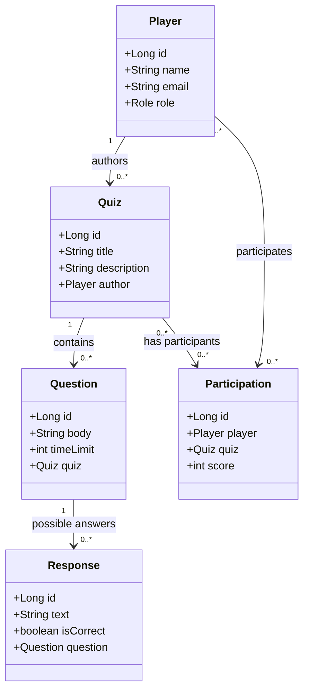

---

### 3.3 Diagramme des services pour chaque entité

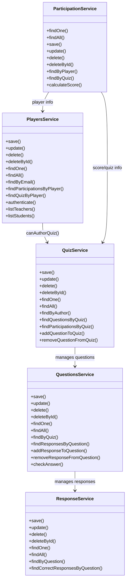
---

### 3.2. Description des entités

| Entité        | Description                         | Relations                                                            | Règles Métier                     |
| ------------- | ----------------------------------- | -------------------------------------------------------------------- | --------------------------------- |
| Player        | Utilisateur (STUDENT ou TEACHER)    | Peut créer des quizzes (TEACHER), participer à des quizzes (STUDENT) | Email unique, rôle obligatoire    |
| Quiz          | Quiz créé par un Player             | Contient Questions, lié aux Participations                           | Seul un TEACHER peut être auteur  |
| Question      | Question appartenant à un Quiz      | Contient Responses                                                   | Temps limite pour répondre        |
| Response      | Réponse possible pour une Question  | Liée à Question                                                      | Indique si correcte               |
| Participation | Participation d’un Player à un Quiz | Relie Player et Quiz                                                 | Score calculé après participation |

---

## 4. Couche Repository et Facade

### 4.1. Interfaces Repository (`repository/`)

| Interface               | Description                                                                     |
|-------------------------| ------------------------------------------------------------------------------- |
| JpaRepository           | CRUD générique (`findOne`, `findAll`, `save`, `update`, `delete`, `deleteById`) |
| PlayerRepository        | CRUD spécifique Player                                                          |
| QuizRepository          | CRUD spécifique Quiz                                                            |
| QuestionRepository      | CRUD spécifique Question                                                        |
| ResponseRepository      | CRUD spécifique Response                                                        |
| ParticipationRepository | CRUD spécifique Participation                                                   |

---

## 5. Services (logique métier)

### 5.1. PlayersService

* CRUD complet sur Player
* Logique métier pour rôles :
    * `TEACHER`: peut créer des quizzes
    * `STUDENT` : peut participer à des quizzes
* Authentification par email
* Méthodes principales :
  * `save`
    * Crée un nouveau joueur après vérification :
    * Email unique et respect les REGEX
    * Format d’email valide 
    * Rôle valide (TEACHER ou STUDENT)
    * Pseudo non vide → Lève une exception si une contrainte d’intégrité n’est pas respectée.
  * `update`
    * Met à jour un joueur existant avec les mêmes contraintes d’intégrité que `save`
  * `delete`
  * `deleteById`
    * Supprime un joueur par son identifiant, sauf s’il est encore auteur de quizzes (intégrité métier).

  * `findOne`
  * `findAll`
  * `findByEmail`
  * `findParticipationsByPlayer`
  * `findQuizByPlayer`
  * `authenticate`
    * Vérifie l’existence d’un joueur par email.

* Contraintes d’intégrité métier
  * `Email `: doit être unique et respecter un format valide
  * `Rôle `: doit être TEACHER ou STUDENT
  * `Pseudo `: ne doit pas être vide
  * `Suppression `: impossible si le joueur est encore auteur de quizzes

#### CRUD et logique métier similaire pour `QuizService`, `QuestionsService`, `ResponseService`, `ParticipationService`

---

## 6. Routes REST

###  Endpoints principaux du PlayerRoute:
#### Description :
Expose les endpoints REST pour la gestion des joueurs (Player).  
Toutes les routes sont documentées avec Swagger/OpenAPI et sécurisées par Spring Security.

#### Endpoints principaux :

* `GET /api/players`  
  Récupère la liste de tous les joueurs.

* `GET /api/players/{id}`  
  Récupère un joueur par son identifiant.

* `POST /api/players`  
  Crée un nouveau joueur (réservé au rôle TEACHER).

* `PUT /api/players/{id}`  
  Met à jour un joueur existant.

* `DELETE /api/players/{id}`  
  Supprime un joueur par son identifiant (réservé au rôle TEACHER).

* `GET /api/players/email/{email}`  
  Recherche un joueur par email.

* `POST /api/players/auth?email={email}`  
  Authentifie un joueur par email.

* `GET /api/players/{id}/participations`  
  Liste les participations d’un joueur.

* `GET /api/players/{id}/quizzes`  
  Liste les quizzes créés par un joueur.

#### Exemple d’annotations Spring :

```java
@RestController
@RequestMapping("/api/players")
@Tag(name = "Players", description = "Endpoints for managing players")
public class PlayerRoute {

    @GetMapping
    @PreAuthorize("hasAnyRole('TEACHER', 'STUDENT')")
    @Operation(summary = "Get all players", description = "Returns a list of all players")
    public ResponseEntity<List<PlayerDto>> getAllPlayers() { ... }

    @GetMapping("/{id}")
    @PreAuthorize("hasAnyRole('TEACHER', 'STUDENT')")
    @Operation(summary = "Get player by ID", description = "Fetches a player by their ID")
    public ResponseEntity<?> getPlayer(@PathVariable("id") Long id) { ... }

    @PostMapping
    @PreAuthorize("hasRole('TEACHER')")
    @Operation(summary = "Add a new player", description = "Creates a new player in the system")
    public ResponseEntity<?> addPlayer(PlayerDto player) { ... }

    @PutMapping("/{id}")
    @PreAuthorize("hasAnyRole('TEACHER', 'STUDENT')")
    @Operation(summary = "Update a player", description = "Updates an existing player's information")
    public ResponseEntity<?> updatePlayer(@PathVariable("id") Long id, PlayerDto player) { ... }

    @DeleteMapping("/{id}")
    @PreAuthorize("hasRole('TEACHER')")
    @Operation(summary = "Delete a player", description = "Deletes a player by ID")
    public ResponseEntity<?> deletePlayer(@PathVariable("id") Long id) { ... }

    @GetMapping("/email/{email}")
    @PreAuthorize("hasAnyRole('TEACHER', 'STUDENT')")
    @Operation(summary = "Get player by email", description = "Fetches a player using their email address")
    public ResponseEntity<?> getPlayerByEmail(@PathVariable("email") String email) { ... }

    @PostMapping("/auth")
    @PreAuthorize("hasAnyRole('TEACHER', 'STUDENT')")
    @Operation(summary = "Authenticate a player", description = "Authenticate a player using email")
    public ResponseEntity<?> authenticate(@RequestParam("email") String email) { ... }

    @GetMapping("/{id}/participations")
    @PreAuthorize("hasAnyRole('TEACHER', 'STUDENT')")
    @Operation(summary = "Get participations of a player", description = "Fetches all participations of a given player")
    public ResponseEntity<?> getPlayerParticipations(@PathVariable("id") Long id) { ... }

    @GetMapping("/{id}/quizzes")
    @PreAuthorize("hasAnyRole('TEACHER', 'STUDENT')")
    @Operation(summary = "Get quizzes of a player", description = "Fetches all quizzes authored by a given player")
    public ResponseEntity<?> getPlayerQuizzes(@PathVariable("id") Long id) { ... }
}
```


---

### 6.3. SwaggerRoute
#### Description :
Expose les endpoints REST pour la gestion Swagger/OpenAPI.

#### Endpoints principaux :

*`GET /api/"`
Récupère toute la documentation de toutes les routes.

*`GET /api/{path:.*}`
Récupère la documentation d'une route spécifique.


#### Exemple d’annotations JAX-RS et Swagger :

```java
@Path("/api")
public class SwaggerResource {

    @GET
    public byte[] Get1() { ... }

    @GET
    @Path("{path:.*}")
    public byte[] Get(@PathParam("path") String path) { ... }
    
}
```

---

## 6. Client REST → Spring REST Controller → Service → Repository → Modèle → BDD ...

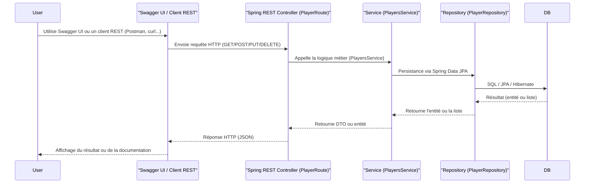

>>Swagger UI ou tout client REST (Postman, curl, etc.) remplace la couche JSP/Servlet. Les routes REST (dans rest/, ex: PlayerRoute) reçoivent les requêtes HTTP. La logique métier est dans la couche service/ (ex: PlayersService). La persistance est gérée par les repositories Spring Data JPA (repository/). La base de données est accédée via JPA/Hibernate. Les réponses sont renvoyées en JSON via les contrôleurs REST, et documentées/interactives grâce à Swagger/OpenAPI.
---

## 7. Couche Web (Swagger)

#### Exemple : Screenshots de la documentation Swagger :

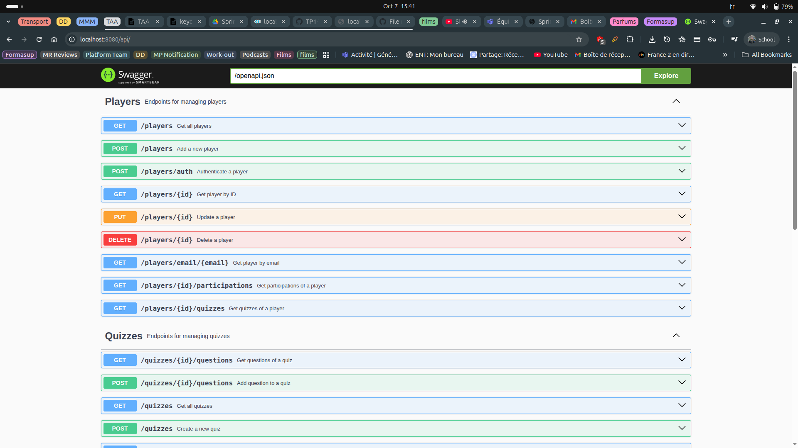
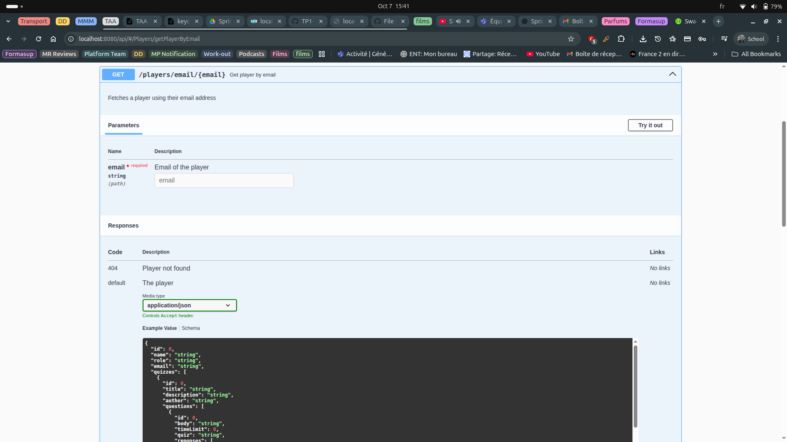
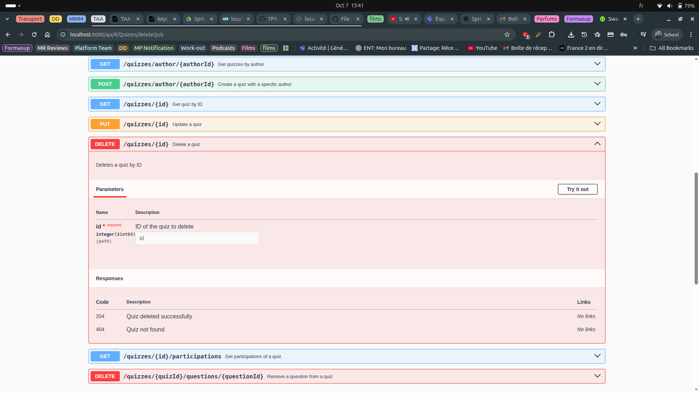

---

## 8. Components Web (HTML/CSS)

* **HTML** : affichage dynamique des listes et formulaires (`allPlayers.html`, `allQuizzes.html`, `playerForm.html`, `quizForm.html`)
* **CSS** : styles pour formulaires et listes (`allPlayersForm.css`, `playerForm.css`)
* **Images** : logo ISTIC (`istic.png`)

Exemple : Screenshots des pages jsp quiz/player ... :

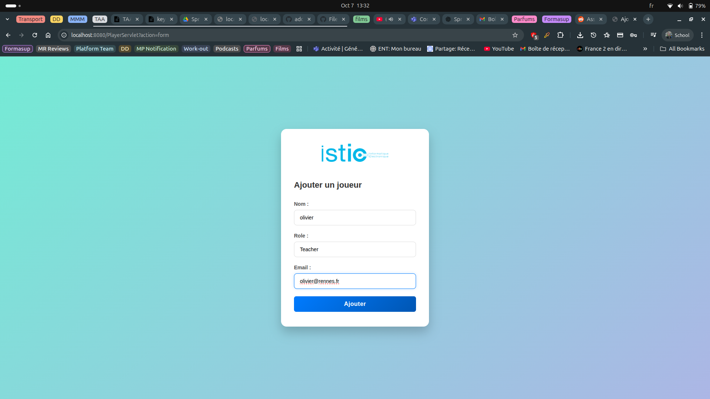
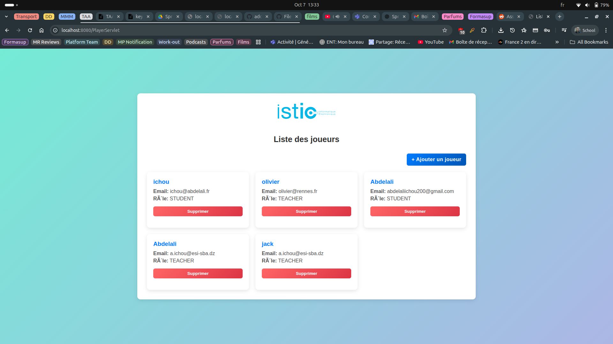
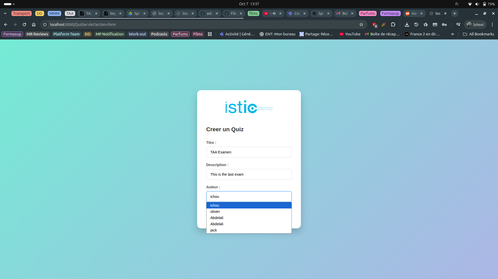

---

## 9. Logique métier détaillée

### 9.1. Players

* TEACHER :

    * Peut créer des quizzes
    * Peut être sélectionné comme auteur
* STUDENT :

    * Peut participer aux quizzes
    * Ne peut pas être auteur

### 9.2. Quizzes

* Contient Questions et réponses possibles
* Lié à un Player (auteur)
* Participation et score calculé côté ParticipationService

### 9.3. Participation

* Liée à Player et Quiz
* Contient le score final
* Permet le suivi des performances des étudiants

---

## 9. MapStruct et sérialisation des objets

### 9.1. Introduction

Dans ce projet, la conversion entre les entités JPA (modèle de la base de données) et les objets de transfert de données (DTO) est automatisée grâce à **MapStruct**.  
MapStruct est un framework Java de mapping qui génère automatiquement le code de conversion entre différents types d’objets, ce qui évite le code répétitif et réduit les erreurs.

---

### 9.2. Déclaration des mappers

Chaque entité principale possède une interface Mapper annotée avec `@Mapper(componentModel = "spring")`.  
Exemple pour `Player` :

```java
@Mapper(componentModel = "spring")
public interface PlayerMapper {
    PlayerDto toDto(Player player);
    Player toEntity(PlayerDto dto);
    List<PlayerDto> toDtoList(List<Player> players);
    List<Player> toEntityList(List<PlayerDto> dtos);
}
```

* `toDto` : convertit une entité vers un DTO
* `toEntity` : convertit un DTO vers une entité
* `toDtoList` : convertit une liste d’entités vers une liste de DTO
* `toEntityList` : convertit une liste de DTO vers une liste d’entités7

### 9.2. Utilisation dans le service

Les mappers sont injectés automatiquement par Spring et utilisés dans les services pour transformer les objets :

```java
// Conversion d'une entité vers un DTO
PlayerDto dto = playerMapper.toDto(player);

// Conversion d'une liste d'entités vers une liste de DTO
List<PlayerDto> dtos = playerMapper.toDtoList(playerRepository.findAll());

// Conversion d'un DTO vers une entité
Player entity = playerMapper.toEntity(dto);
```

### 9.3. Fonctionnement de la sérialisation

* `Entrée API `: Les contrôleurs REST reçoivent des objets DTO (ex : PlayerDto) en JSON.
* `Service :` Le service convertit le DTO en entité JPA avec le mapper, puis effectue la logique métier et la persistance.
* `Sortie API `: Les entités récupérées sont converties en DTO via le mapper, puis renvoyées en JSON au client.

### 9.5. Exemple complet
Supposons que l’on veuille retourner tous les joueurs :

```java
@GetMapping
public ResponseEntity<List<PlayerDto>> getAllPlayers() {
    // playerRepository.findAll() retourne List<Player>
    // playerMapper.toDtoList(...) convertit List<Player> en List<PlayerDto>
    return ResponseEntity.ok(playerMapper.toDtoList(playerRepository.findAll()));
}
```

### 9.6. Avantages
* `Automatisation` : plus besoin d’écrire manuellement les conversions
* `Lisibilité` : le code métier reste clair et centré sur la logique fonctionnelle
* `Performance` : MapStruct génère du code Java natif, donc très rapide

### 9.7. Liste des mappers du projet
* `PlayerMapper` : Player ↔ PlayerDto
* `QuizMapper` : Quiz ↔ QuizDto
* `QuestionMapper` : Question ↔ QuestionDto
* `ParticipationMapper` : Participation ↔ ParticipationDto
* `ResponseMapper` : Response ↔ ResponseDto

---

## 10. Sécurité Spring Boot : Configuration, Contrôleurs et Usage

### 10.1. Architecture de la sécurité

```mermaid
flowchart TD
    subgraph "Spring Security"
        A[WebSecurityConfig\n(prod)] -->|JWT, roles, restrictions| B[Secured Routes\n(@PreAuthorize)]
        C[DevSecurityConfig\n(dev)] -->|All allowed| B
    end

    D[SecurityRoute\n(MVC Controller)] -->|Display views by role| B
    E[REST Controllers\n(PlayerRoute...)] -->|@PreAuthorize endpoints| B
    F[Client REST/Postman] -->|JWT Bearer Token| B
```
* `WebSecurityConfig.java` : Active en production `(@Profile("!dev"))`.
    * Configure l’accès aux routes selon les rôles (`TEACHER`, `STUDENT`) extraits du token JWT.
    * Utilise les claims `realm_access.roles` pour mapper les rôles Keycloak vers Spring Security.
    * Restreint l’accès aux endpoints via `.requestMatchers()` et gère les exceptions d’accès.

* `DevSecurityConfig.java`: Active uniquement en développement `(@Profile("dev"))`.
    * Désactive toute restriction: toutes les routes sont accessibles sans authentification.
    * Permet de tester l’application sans avoir besoin de Keycloak ou de token.
* `securityRoute.java` : Contrôleur MVC pour les vues HTML.
    * Utilise `@PreAuthorize` pour restreindre l’accès aux pages selon le rôle.
    * Injecte l’objet d’authentification dans les vues pour afficher les infos utilisateur.
* `@PreAuthorize dans les routes REST`
    * Les contrôleurs REST (ex: `PlayerRoute`) utilisent `@PreAuthorize("hasRole('TEACHER')")` ou `hasAnyRole('TEACHER','STUDENT')` pour sécuriser chaque endpoint.
    * Le rôle est extrait du JWT envoyé par le client (Postman, Swagger UI…).


### 10.3. Utilisation en développement

* Pour bypasser la sécurité (tests sans authentification), activez le profil dev:
  * Dans `application.properties`: `spring.profiles.active=dev`
  * Toutes les routes deviennent accessibles sans token ni rôle.

### 10.4. Utilisation en production

* En production (profil par défaut), la sécurité est activée:
  * Les routes `/teacher/**` sont accessibles uniquement aux utilisateurs avec le rôle `TEACHER`.
  * Les routes `/student/**` sont accessibles uniquement aux utilisateurs avec le rôle `STUDENT`.
  * Les routes REST sont protégées par les annotations `@PreAuthorize`.
  * Un `token JWT` valide doit être envoyé dans l’en-tête `Authorization: Bearer <token>`.


### 10.5. Exemple d’appel sécurisé avec Postman

Requête: 
```shell
    GET http://localhost:9000/api/players
    Authorization: Bearer <votre_token_jwt>
```
Réponse:
```json
Si le token est valide et contient le rôle requis, la réponse JSON s’affiche. Sinon, une erreur 403 ou 401 est retournée.
```

### 10.6. Capture d’écran Postman
Exemple Postman avec token JWT valide

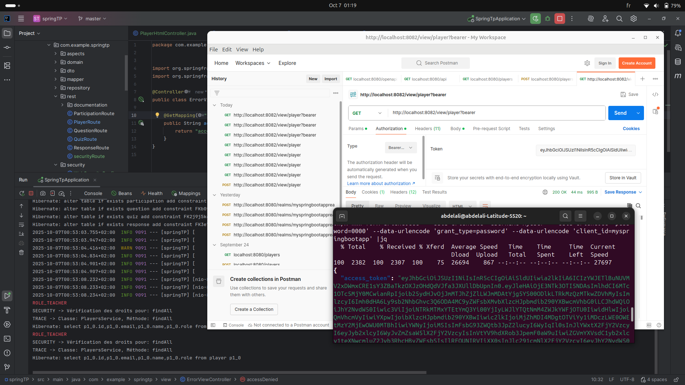


### 10.7. Résumé
* Sécurité stricte en production, ouverte en dev.
* Les rôles sont extraits du JWT et utilisés dans les annotations @PreAuthorize.
* Les contrôleurs REST et MVC sont protégés selon le rôle utilisateur.
* Facile à tester sans sécurité grâce au profil dev.

---

## 11. Spring AOP (Aspects)

### Introduction

La programmation orientée aspect (AOP) permet de séparer les préoccupations transversales (comme le logging ou la sécurité) de la logique métier principale.  
Avec Spring AOP, on définit ces comportements dans des classes appelées **aspects**, qui sont appliqués automatiquement sur les méthodes ciblées.

---

### Concepts clés

- **Aspect** : Module qui contient du code transversal (ex: logging, sécurité).  
  → Défini par une classe annotée `@Aspect`.

- **Join point** : Point d’exécution du programme où un aspect peut intervenir (ex: appel d’une méthode de service).

- **Pointcut** : Expression qui définit où (quels join points) un aspect doit s’appliquer.  
  → Exemple: `execution(public * com.example.springtp.service..*(..))` cible toutes les méthodes publiques des services.

- **Advice (Greffon)** : Le code exécuté avant, après, ou autour du join point.
    - `@Before`: exécuté avant la méthode cible
    - `@Around`: entoure l’appel, permet de bloquer ou modifier l’exécution

- **Weaving (Tissage)** : Processus qui insère les aspects dans le code cible (fait dynamiquement au runtime par Spring).

---

### Aspects du projet

#### 1. traceAspect.java

- **But** : Journaliser chaque appel de méthode dans la couche service.
- **Pointcut** : Toutes les méthodes publiques des services.
- **Advice** : `@Before` → Affiche le nom de la classe et de la méthode appelée.

```java
@Before("execution(public * com.example.springtp.service..*(..))")
public void logBefore(JoinPoint joinPoint) {
    String className = joinPoint.getTarget().getClass().getSimpleName();
    String methodName = joinPoint.getSignature().getName();
    System.out.println("TRACE -> Classe: " + className + ", Méthode: " + methodName);
}
```

#### 2. authorizationAspect.java

* But : Vérifier les droits d’accès sur toutes les méthodes du service `PlayersService`.
* Pointcut : Toutes les méthodes de `PlayersService`.
* Advice : `@Around `→ Affiche un message de vérification, peut bloquer l’exécution si non autorisé.

```java
@Around("execution(* com.example.springtp.service.PlayersService.*(..))")
public Object checkSecurity(ProceedingJoinPoint pjp) throws Throwable {
    System.out.println("SECURITY -> Vérification des droits pour: " + pjp.getSignature().getName());
    boolean authorized = true;
    if (!authorized) {
        throw new RuntimeException("Access denied!");
    }
    return pjp.proceed();
}
```

#### Avantages
* Lisibilité: La logique métier reste claire, sans code de logging ou de sécurité dispersé.
* Réutilisabilité: Un aspect peut s’appliquer à plusieurs classes/méthodes sans duplication.
* Maintenance: Modifier un comportement transversal se fait en un seul endroit.

---

## 12. Exemple d’utilisation

```        
sudo docker run --name some-mysql  -p 3306:3306 -e MYSQL_ROOT_PASSWORD=my-secret-pw -d mysql:latest
sudo docker run --name myadmin -d --link some-mysql:db -p 8082:80 phpmyadmin
sudo docker start some-mysql myadmin
./run-hsqldb-server.sh     
./show-hsqldb.sh   
```

#### Lancer l’application

| Task                           | Command                            |
|--------------------------------| ---------------------------------- |
| Run the app during development | `./mvnw spring-boot:run`           |
| Build JAR for deployment       | `./mvnw clean package`             |
| Skip tests during build        | `./mvnw clean package -DskipTests` |
| Clean & build project          | `./mvnw clean install`             |
| Check dependencies             | `./mvnw dependency:tree`           |


1. Accéder à `http://localhost:9000/view/player` pour gérer les joueurs
2. Accéder à `http://localhost:9000/view/quiz` pour gérer les quizzes
3. Utiliser les JSP pour ajouter, modifier, supprimer des entités
4. Accéder à `http://localhost:8082` avec user = `root` & pass = `my-secret-pw`
5. Crée nouvelle database qui s'appelle selon le fichier persistance.xml `mydatabase`

Exemple : Screenshots aprés lancement de tout ... :

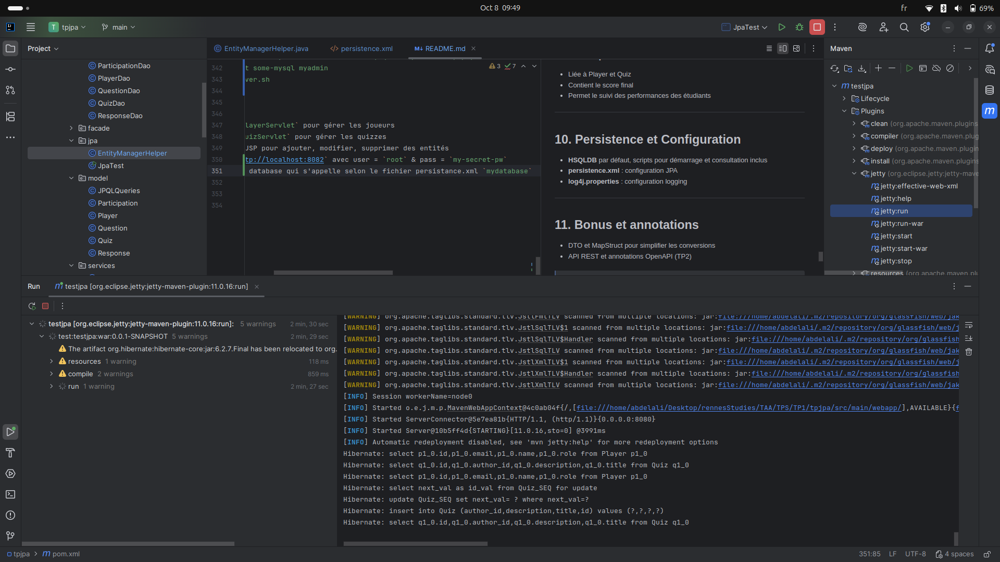


---

WE ADD KEYCLAOCK CONF AUTOMATION
WE ADD HOW TO RUN EVERYTHING IN DOCKER

---
## Big Picture

| Feature            | Old Spring (manual)                 | New Spring Boot + Spring Data JPA  |
| ------------------ | ----------------------------------- | ---------------------------------- |
| **DAO/Repository** | Hand-coded DAO with `EntityManager` | `JpaRepository` interface          |
| **Queries**        | Manual JPQL/SQL                     | Method names + `@Query`            |
| **DI**             | `@Autowired` fields / XML           | Constructor injection              |
| **EntityManager**  | Explicit use                        | Hidden behind Spring Data          |
| **Beans**          | Declared manually                   | Auto-scanned by Boot               |
| **Interfaces**     | Often skipped                       | Always injected, proxies generated |
| **Aspects**        | Manual or XML                       | Declarative `@Aspect`              |
| **Transactions**   | Manual / XML                        | `@Transactional`                   |
| **Startup**        | External server (WAR)               | Embedded server (fat JAR)          |
| **Focus**          | Boilerplate & plumbing              | Business logic                     |

---
